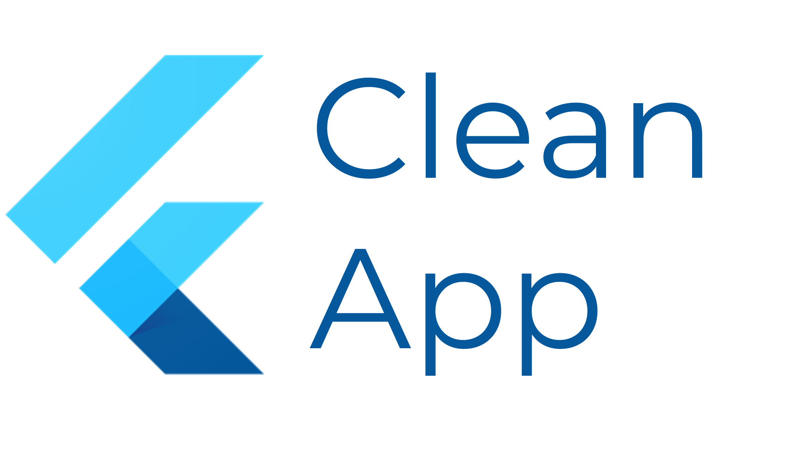

<div align="center">
  

  <h3 align="center">Flutter Clean App</h3>

  <p align="center">
    A project inspired by the rules from Uncle Bob. Based on Reso Coder tutorial.
  </p>
</div>

## About the content

My original ideia is to build a App for practice what I'm learning from the series of books from Uncle Bob (Clean Code, Clean Coder, Clean Architecture). Also, I studied the architecture proposed by Reso (available on his [Flutter Clean Architecture TDD Tutorial](https://resocoder.com/flutter-clean-architecture-tdd/) and modified it a little bit to fit for my own projects.

## What I'm dealing with

### Dependency Injection: Get It or GetX
I'm used to develop with the [Get It package](https://pub.dev/packages/get_it) for dependency injection, and since I use [GetX package](https://pub.dev/packages/get) for state and route management I was figuring out if I can use only GetX for everything.

Well, after some analysis in the GetX documentation, I figured that the benefits of getting of a package doesn't worth the cost. My opinion is that the GetIt have a really quickly way to pass dependencies across classes. For example, if I create the class DoSomethingUseCase and want to pass another class as a instance variable, that I'll call SomeRepository, I just have to do:

```
final sl = GetIt.instance;

void init() {
  getIt.registerSingleton<SomeRepository>(
    () => SomeRepository();
  );
  getIt.registerSingleton<DoSomethingUseCase>(
    () => DoSomethingUseCase(repository: sl()),
  );
}

class DoSomethingUseCase (
  final SomeRepository repository;
  
  DoSomethingUseCase({required this.repository});
}

class SomeRepository {}
```
